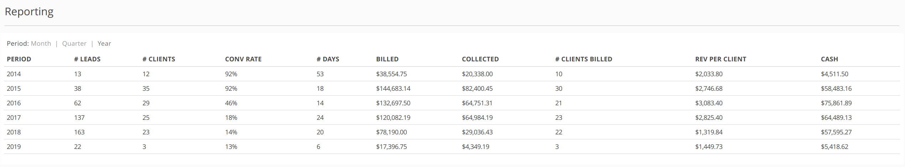

# Challenge 1 - Cohort report

This reports combines four different data sources for different aspects
of business performance. The data files are in [the data directory](data/).

Your job is to combine the data sources, and compute a couple of derived
values. There should be a UI element for grouping the data by month, quarter,
or year.

The columns in the report are:

 * Period
 * Number of leads
 * Number of leads converted into clients
 * Conversion rate
 * Average time (in days) to convert
 * Total amount billed
 * Total amount collected
 * Number of clients billed
 * Average revenue per client
 * Cashflow
